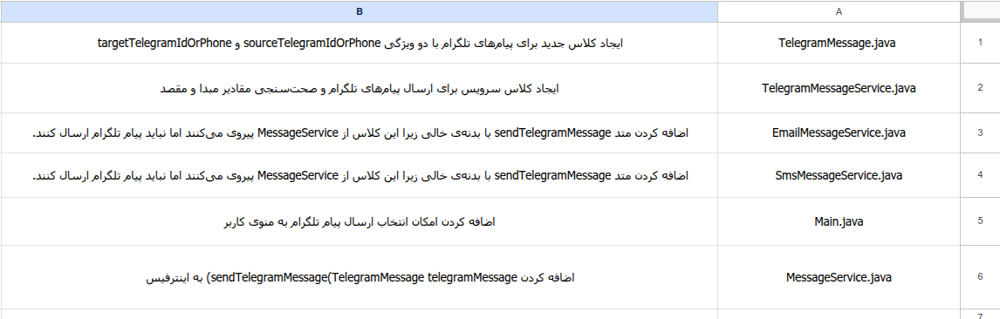
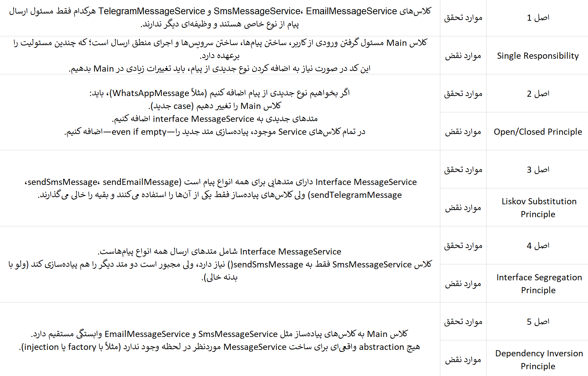
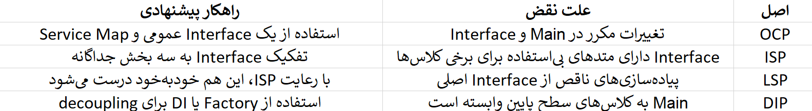

# se_lab2_inheritance

step2:

---------------------------

step3:

---------------------------

step4:

پاسخ سوال ۱
سوال:
اگر اصول شی‌گرایی از ابتدا برقرار بود و شما سرویس جدید را به پروژه اضافه می‌کردید، چند مورد از تغییرات ثبت‌شده در جدول مرحله دوم حذف می‌شد؟ و در نهایت با چند تغییر در سطح کد، این سرویس اضافه می‌شد؟ (عدد آن را حتماً اعلام کنید.)

پاسخ:
در کد «قبل از رعایت SOLID» برای اضافه کردن سرویس تلگرام نیاز به تغییر در موارد متعددی داشت؛ مثلاً افزودن یک case در ساختار switch، ایجاد شیء مربوط به سرویس و نیز استفاده از بلوک‌های شرطی مخصوص شناسایی نوع پیام. اما در نسخه «پس از رعایت SOLID»، با بهره‌گیری از الگوی Factory و یک Dispatcher مرکزی، تنها کافی بود کلاس مربوط به سرویس تلگرام (هم به عنوان مدل و هم به عنوان سرویس) ایجاد شده و در فایل Factory ثبت شود. بنابراین، اگر اصول شی‌گرایی از ابتدا برقرار بود، به جای چندین (مثلاً ۴) تغییر در بخش‌های مختلف، تنها ۱ تغییر (افزودن ثبت مورد مربوط به سرویس جدید در کارخانه) لازم بود.

پاسخ سوال ۲
سوال:
با توجه به آنچه که انجام دادید، در دو خط توضیح دهید که رعایت اصول شی‌گرایی، چه مزایایی را برای پروژه شما فراهم می‌کند؟

پاسخ:
رعایت اصول شی‌گرایی باعث جداسازی و استقلال مسئولیت‌ها می‌شود، بدین ترتیب افزودن یا تغییر یک سرویس جدید بدون دست‌کاری کد موجود امکان‌پذیر بوده و نگهداری، تست و توسعه سیستم را به شدت ساده می‌کند. همچنین کدی بسیار قابل فهم، انعطاف‌پذیر و توسعه‌پذیر ایجاد می‌شود که کاهش وابستگی‌های غیرضروری را به همراه دارد.
